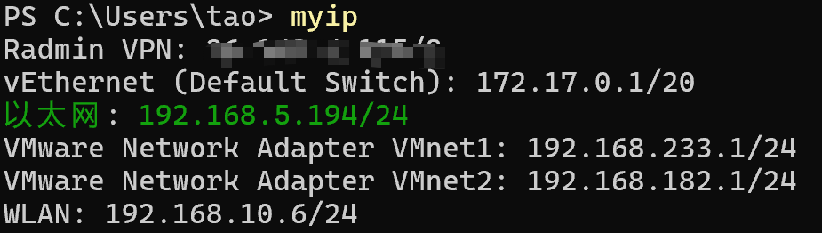
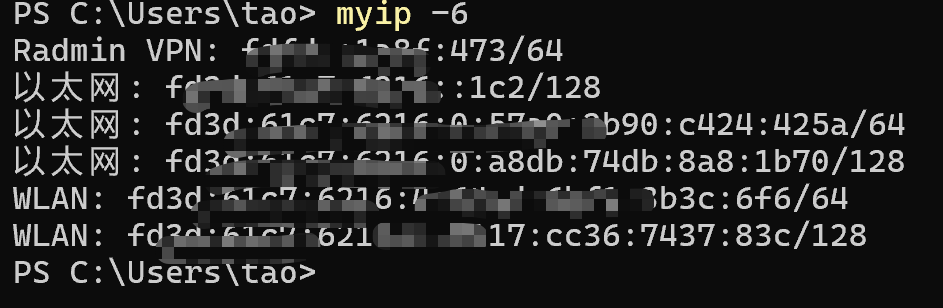
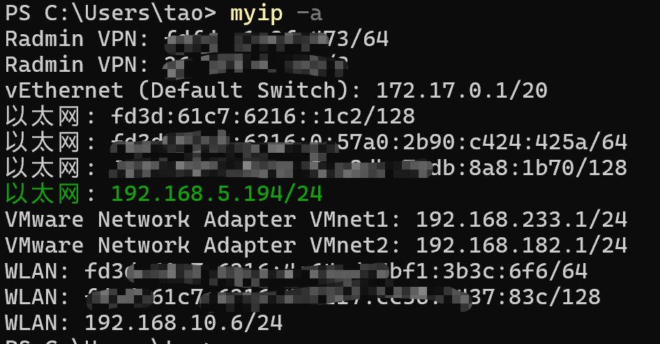
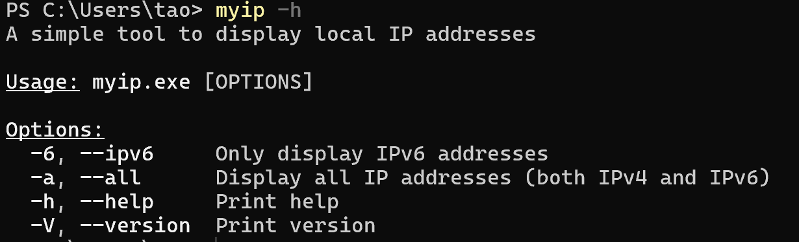

# myip

A simple and beautiful command-line tool to display local IP addresses with network interface information.

[English](README.md) | [中文](README_zh.md) | [日本語](README_ja.md)

## Features
- Shows main IP address (used for internet connection) highlighted in green
- Displays IP addresses with their corresponding network interface names
- Shows IP addresses in CIDR format (e.g., 192.168.1.100/24)
- Supports both IPv4 and IPv6 address display
- Command-line options for filtering IP address types
- Cross-platform compatibility

## Dependencies
- `clap` - Command line argument parsing
- `colored` - Colored output support
- `getifs` - Network interface information retrieval

## Installation

### Prerequisites
- Rust programming language installed (version 1.56.0 or higher)

### Build from source
```bash
git clone <repository-url>
cd myip
cargo build --release
```

The executable will be located at `target/release/myip`.

## Usage

### Basic usage (show IPv4 addresses only)
```bash
myip
```



### Display only IPv6 addresses
```bash
myip -6
```



### Display all IP addresses (both IPv4 and IPv6)
```bash
myip -a
```



### Display help information
```bash
myip -h
```



## Command-line Options

| Option | Description |
|--------|-------------|
| `-6`, `--ipv6` | Only display IPv6 addresses |
| `-a`, `--all` | Display all IP addresses (both IPv4 and IPv6) |
| `-h`, `--help` | Print help information |
| `-V`, `--version` | Print version information |

## Output Example

```
Ethernet: 192.168.1.100/24
Wi-Fi: 192.168.10.5/24  <-- Main IP (highlighted in green)
Loopback: 127.0.0.1/8
```

## License

MIT License

[English](README.md) | [中文](README_zh.md) | [日本語](README_ja.md)